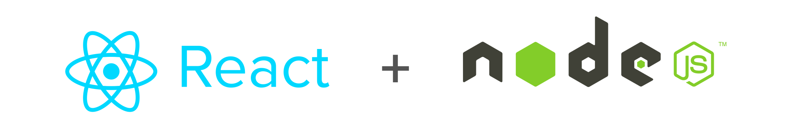

<h1 align="center">
    
</h1>

<h4 align="center"> 
	:construction: Catalog 🚀 In progress.. :construction:
</h4>

	
  	
	
  

  
	
  

  

  
   

## 💻 Project

Simple product catalog

## :rocket: Technologies

This project was developed with the following technologies:

- [Node.js][nodejs]
- [TypeScript][typescript]
- [React][react]
- [React Native][reactnative]
- [Expo][expo]

## :memo: License

This project is under the MIT license. See the [LICENSE](https://github.com/vininet17/catalog-miwsm/blob/master/LICENSE) for details.

Made with ♥ by Vinicius Lazzari :wave: [Get in touch!](https://www.linkedin.com/in/viniciuslazzari/)

[nodejs]: https://nodejs.org/
[typescript]: https://www.typescriptlang.org/
[reactnative]: https://reactnative.dev/
[react]: https://pt-br.reactjs.org/
[expo]: https://expo.io/
